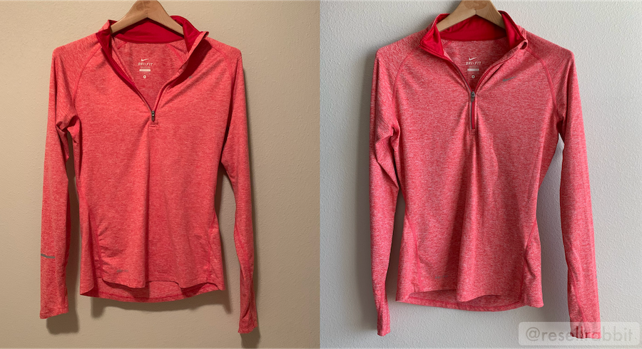

Knowing how to list on Poshmark can make or break how well you sell. You need to focus on SEO so potential buyers can find your items and you need to make a good impression so they buy! 

***This is Chapter 2  of the [Poshmark Ultimate Guide to Reselling]( {{base_url}}/guides/poshmark-ultimate-guide ).***

### Sections
1. seed
{:toc}

##### Section 1
{: class="section-header"}
## 👘 Prepare the garment for a photoshoot

### Break out the steamer and lint-roller
Buyers expect the item to be the exact condition it's listed as, so if the item has wrinkles and pet hair and you make it explicit then it's okay to sell it as is. However, it's possible that the item will take longer to sell or you'll receive lower offers because of this. 

It because of this that it's worthwhile to steam out obvious wrinkles in the clothing, lint-roll  pet hairs and little fuzzies, and cut off any loose strings. 

### Choose how you prefer to display the item

There are three ways you can display the item: flat-laying, hanging, or modeling the item. There's no true answer to what is best since it can really depend on the garment. For example, if you're selling a jacket and it's too large, then modeling the jacket may make it look overly clunky and not flattering.

##### Laying flat
Flat-lays are when the item is flat on a surface and the viewer has an eagle-eye perspective of the garment. This works particularly well when taking photos of pieces of an outfit together. Please keep in mind to not lay the item on a dirty surface. For example opt to lay it on a white bed sheet or white rug, not the grass outside.

**Pro:** Easy to see patterns or symmetry of the item

**Con:** Not very easy to set up (like having to rotate photos afterward all the time)

##### Hanging on a hanger
Hanging the item is sometimes the easiest. What I'd do is stick a clear command hook on the wall, then use a wooden hanger (talk about high class!) to display the piece. 

**Pro:** Easy to set up and fast to change out clothes 

**Con:** Can make looser clothes look particularly boxy

##### Modeling 
In my opinion, whether or not to model the item can be very dependent to what the item is and how it fits the model. If you do model, you should consider cropping out your face and background items to protect your privacy. You can take photos of yourself modeling by using a full-length mirror, or picking up a cheap tripod and setting the camera on "selfie" mode.

**Pros:** Gives the item more dimension and a better idea of how it fits. You can enhance the look of the item by putting on matching clothes (i.e. Wearing a crop top with high-waisted jeans versus mid-cut shorts, or wearing a V-neck top with a necklace) 

**Cons:** Can attract unwanted attention (think creep with no intention of buying the item).* May  make buyers uncomfortable to see an item they like worn by someone else.* Takes longer than the other options.

*Mannequins solve these cons.

### Be mindful of the background

Whenever you take photos, please be mindful of what is on display in the background behind the item. A clean bright white background is best. Some sellers optionally like to add small props like plants to add a bit of color and create a better aesthetic. If you're modeling and have to show your room in the background, maybe take a minute to push the pile of dirty laundry out of the frame :)

##### Section 2
{: class="section-header"}
## 📷 Take accurate and flattering photos

Taking good photos for your items is one of the most important part of the sales process. It's the first thing that a buyer will see about your item. I know it seems obvious but if you open the app, you will still see many listing with poor lighting and angles. I'm going to walk through the specific steps you can take to make your photos more flattering.

### A phone camera is just fine

These days cellphone technology is so good that taking a photo from a $700 camera versus an iPhone isn't going to make a huge difference in this case. It's not worth investing in a good camera to take inventory photos. It's also easier to export your photos using your phone as well. 

**Quick tip:** Use the "square" composition when taking photos since all Poshmark photos use that dimension. I also like to turn on guides so I can make sure I'm holding the camera straight.

### Lighting

Lighting is absolutely important as it can change the entire look of the piece. If you're a more seasoned reseller, you may consider in investing in a lightbox tent which shines bright light on all angles of the garment.

However, these can be pricey and in this case natural lighting is the way to go. Try to take photos early in the day, and set the item next to a large window. I suggest avoiding artificial lighting when you can because it will make your photos darker and can add a yellow tint to your photos. 

**Artificial Light vs Natural Light**
{: class="text-center"}

### Post-editing

To enhance your photos, you can use a free photo editing app like [Lightroom](https://lightroom.adobe.com/){:target="_blank"} or [VSCO](https://vsco.co/){:target="_blank"}. You import your photos from your phone onto the computer (or stick to the phone app) and then use the app to edit the contrast, saturation, color tint, and shadows. These photos settings are saved as presets, where you can apply to all your other photos in one click. 

There are also tools that remove the background from the product you're photographing like [remove.bg](https://www.remove.bg/?utm_source=share&utm_medium=ios_app){:target="_blank"}, [PhotoRoom](https://photoroom.com/){:target="_blank"}, and [Canva](https://www.canva.com/){:target="_blank"}.

Do keep your photos accurate so your buyers aren't surprised if they expect a different color. Avoid any photo filters that have a colored tint or vignette.

### Use stock photos

OK technically we're not supposed to use stock photos since your normal reseller likely doesn't have official permission to use the photos of a big brand, but many people do it anyway. I'd tread with caution here, but I wouldn't worry unless you've already received a warning on it.

Using stock photos is ideal because you know the item is shown clearly and is fitted well on the model. 

To find a stock photo, you can Google the keywords matching your item, or you can Google the product number on the fabric tag of the item. Then you can download the photo onto your phone or computer. If you're not able to save the image, then you can take a screenshot of the page and then crop the photo.

### Be thorough

You can post up to 16 photos, use it to your advantage! What buyers are looking for is accurate photos of the item, so take photos of the front, the back, the tags (tags with brand and fabric details, price tag), a close up of the fabric, the features of the item. 

Some sellers like to take time to take an image of the item with measurements too. This is great because visually seeing the measurement is easier to understand than reading it, but the downside is this makes the whole listing process a bit longer. It still is faster than measuring, noting it down, and pasting it into the description though.

### Strategically order your photos

Prioritize the best photos. For example this is the order I'd post my photos:
1. Stock photos
2. Front of item 
3. Back of item 
4. Closeup photos
5. Item features
6. Tags
7. Measurements
8. (If any) damages
9. (optional) a last clean and aesthetically pleasing photo

In my opinion you should always include images of any damage because it's more relief for you to know the buyer knows exactly what they're getting. But, you don't need to list it as the very first thing to be seen.

#### How do I price an item?

Search up what the original price of the item was, or try to search for similar items on Poshmark to see how much other listings are.

##### Section 3
{: class="section-header"}
## 🔍 Focus on SEO in the title and description

##### What is SEO (Search Engine Optimization)?

Poshmark is in fact a small search engine. Whenever someone searches for some clothing on Poshmark, they’re looking for a result that matches what they want. SEO is the act of making it easier for Poshmark to figure out how relevant your listing is to whatever the buyer searches for. Basically, you want to make it as easy as possible for a buyer to find your item!

##### Why is SEO important?

Most buyers find their items by searching for the item. This is the best time to put your listing in front of them because it means they have the intent to purchase the particular style. To help make sure your listing shows up for the search, you'll need write a good title and description in your listing. 

**Quick tip:** Another thing you can do to make your listing rank above others is by sharing the listing frequently since listings are by default sorted by "Just Shared."



##### Use keywords in your title and description

Keywords are the main words that matches what your buyer may be looking for. A good title is something like **[Brand] [Material] [Style] [Size] [Color]**

A good description has similar information but with item features and optional details. There is some debate whether you should cut down words as much as possible to the necessary words, for example, using "colored in Red" vs. just "Red". I don't think it'll make a much of a difference either way, and you should just prioritize being user friendly in this case.

##### Use a template

 You can save more time by curating a template where you can copy, paste, and fill in the details with.

**Example template:**
<pre>
Features: 
Fabric: 
Size: 
Condition: [New, Like New, Good, Preowned]
Brand:
Comes from a smoke-free home.
No trades please, thanks!
</pre>

**Quick tip:** It's faster to list batches of items using the computer, while it's more convenient to list a couple items on the phone.

## 💡 Bonus Tip
### List frequently

There are two reasons you should list frequently. 

The more listing you have, the more likely it is for someone to find one of your items and look at the rest of your closet. Think of each listing as a possible source of traffic for your closet. And the more eyes there are on your closet, the more you'll sell.

The second reason you should list frequently is because the longer you wait to list the item, the longer it will take for you to make money on it. It sounds obvious when I put it that way, but procrastinating on listing an item you know you want to sell means you could be wasting valuable opportunities where someone could have already found and bought the item. 

What I would do is set time at least once a week to list your new inventory.

### Looking for more?

Over time, you'll get better and better at making great listings. The first step is to just do it and try the tactics that would make _you_ want to buy the item. If you want to learn important Poshmark sales strategies to follow after listing your item, read chapter three of [Poshmark Ultimate Guide to Reselling]( {{base_url}}/guides/poshmark-ultimate-guide ).

